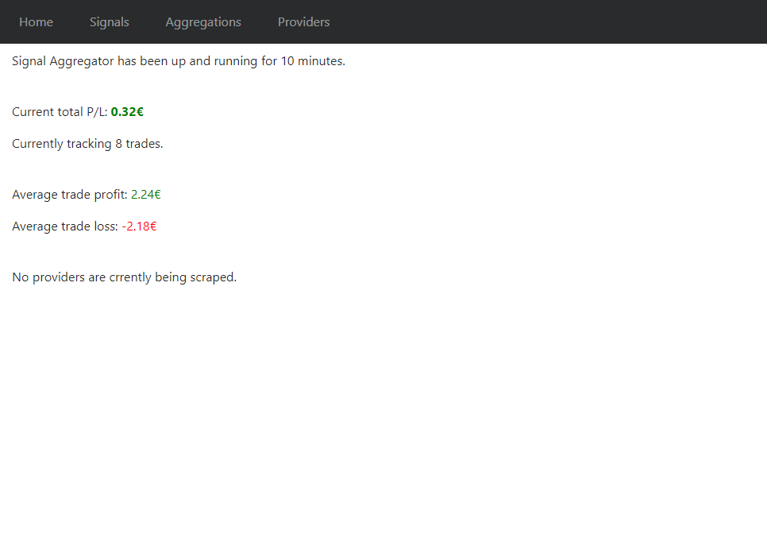
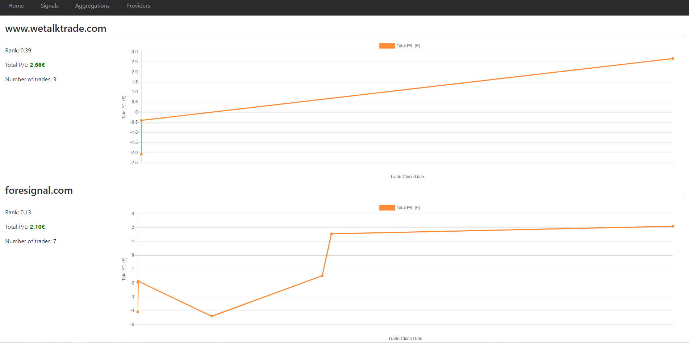
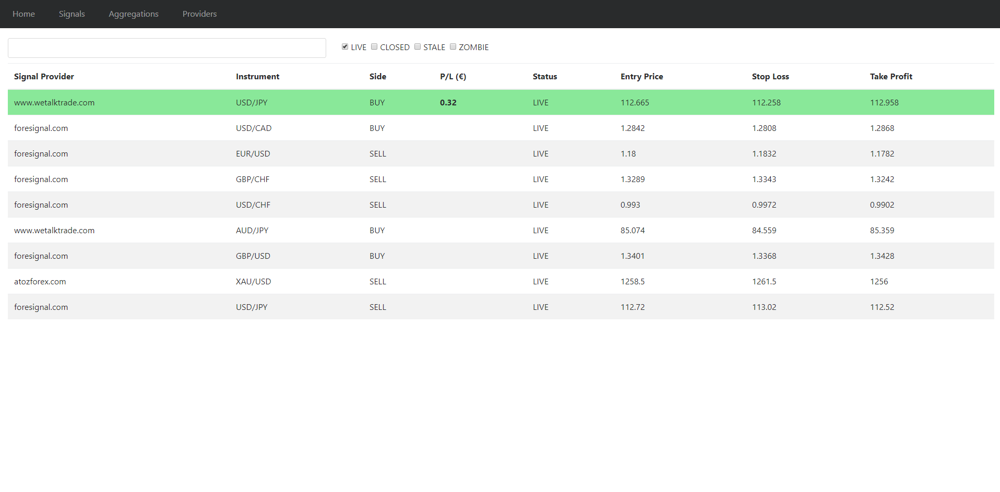
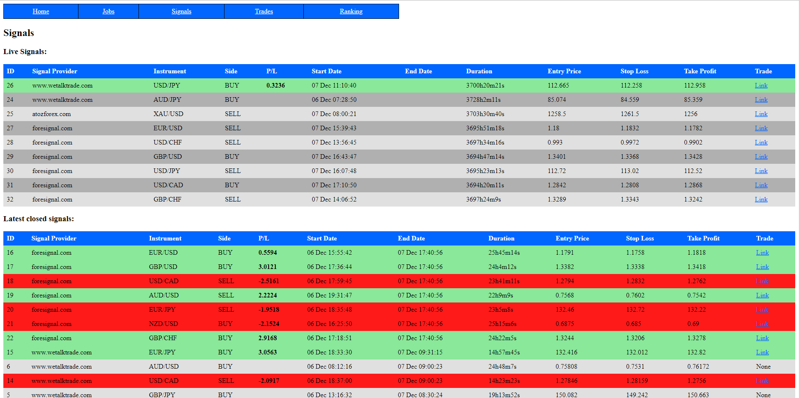
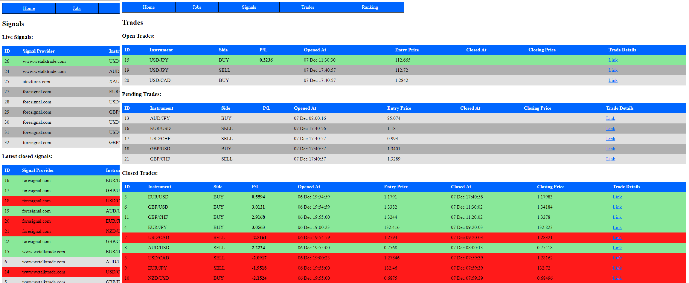

# Forex Signal Aggregator
Monitors the performance of forex signal providers and can detect trends if multiple providers converge on the same signals.

Uses [Spring Boot](https://projects.spring.io/spring-boot/) and [phantomjs](http://phantomjs.org).

## How it works

Periodically scrapes the advertised forex signals from the websites of signal providers. When new signals are published, a corresponding trade (BUY if the signal was a BUY signal, the same with SELL) is opened at OANDA. This is done to assess the performance of the signal when the trade closes.

This way, one can monitor how good the signals that each signal provider provides.

Signal aggregations can also be monitored. If multiple providers send out signals for the same instrument (e.g. EUR_USD) and direction (BUY or SELL) then the app detects an aggregation.

Email can be sent to notify of new signal and/or new aggregations.

Also, see the package `com.quantbro.aggregator.adapters` for attempts to implement scrapers for various signal providers.

## How to Use
### Configure
Rename or copy the `application.properties.example` file to `application.properties`. 

In the same file, make sure to configure your database (MySQL).

Enable the providers you want to scrape data from. There is an example in  the `application.properties.example`file, but here is another one for [WeTalkTrade](https://wetalktrade.com):
<pre>
providers.weTalkTrade.rootUrl = https://signal.wetalktrade.com
providers.weTalkTrade.cronJob = 0 */30 * * * *
providers.weTalkTrade.username = mail@domain.com
providers.weTalkTrade.password = password
providers.weTalkTrade.accountId = 123-123-1231231-123
</pre>

Also, point to a phantomjs binary:
<pre>
phantomJsDriver.location = /users/current/phantomjs
</pre>
### OANDA
This app uses OANDA's API to get Forex data (instruments, prices, etc) therefore an OANDA account is required. Configuration:
<pre>
forexClient.rootUrl = https://api-fxpractice.oanda.com
forexClient.secretKey = secretkey
</pre>

### Build

Build a jar with `./gradlew bootRepackage`. This will create a `signal-aggregator-1.2.1.jar` file inside the `build/libs` folder.

### Run

Start the spring boot service with `java -jar build/libs/signal-aggregator-1.2.1.jar`

Its thymeleaf-based website can be accessed, by default, at http://localhost:8081.

Or, go in signal-aggregator-frontend and do `npm start`, assuming you have npm installed. This is a work-in-progress React.js app that can be accessed at http://localhost:3000.

## Screenshots
Showing is better than telling!

## Disclaimer
The code above is for educational purposes.

Scraping someone's data may or may not be permitted. Make sure you know that you are doing and also get permission first. 
